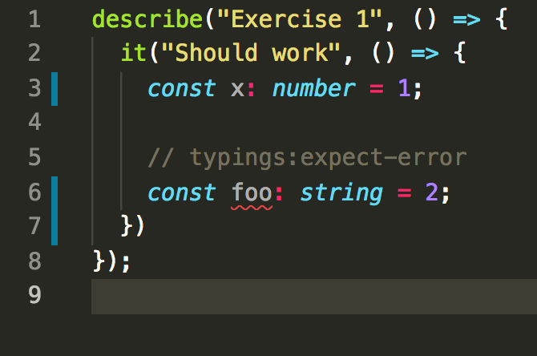

TypeScript Workshop
====================================

Welcome to our TypeScript workshop!

We're happy you're joining us. This repository will serve as our workspace for the workshop. It's empty currently, but by setting it up now you'll get most of the dependencies and we'll lighten the load on the conference wifi.

Before the workshop, we'd appreciate if you could do the following:

1. Install Visual Studio Code. This editor from Microsoft has excellent built-in support for TypeScript. If you choose to use a different editor, ensure it has built-in syntax highlighting and type checking for TypeScript. It may be wise to have Code around if you're unsure whether your editor has first class TypeScript support.
2. Clone up this git repository and install dependencies using the steps below.

Doing this will help things kick off smoothly. Thanks for your help!

## Setting up this work space repository

To make sure you're prepared for the workshop, please do the following:

* Ensure you have node 8 or newer installed. [Install it here](https://nodejs.org/en/download/) or `brew install node`. We've tested with both node 8 and 10. (Use `node --version` to check that you have the right version installed. If you need a different version of node on your machine for another project, check out [nvm](https://github.com/creationix/nvm))

* Clone this repo locally. We will be asking you to pull changes the morning of the workshop, so please clone with `git`, as opposed to downloading a zip file.

* Run `npm install` from this repository. This will download the dependencies for the workspace and help us avoid overly straining the conference wifi.

* Run `npm run exercise-0`. You should see output like the following:

  ```
  > npm test
  
  > ts-workshop@1.0.0 test /Users/colthorp/Repositories/ts-workshop
  > jest
    PASS  __tests__/type-tester.test.ts
    PASS  exercises/exercise-0/exercise.test.ts

    Test Suites: 2 passed, 2 total
    Tests:       2 passed, 2 total
    Snapshots:   0 total
    Time:        1.959s, estimated 3s
    Ran all test suites matching /exercise-0|type/i.
  ```
  This test-running process will remain running until you stop it. When you save changes to a file, the tests will automatically rerun.

* When you're ready to start, check out the `doc` folder in the root of the repo for the workshop slides. Then, open up `exercises/exercise-1/exercise.test.ts` and run `npm run exercise-1` in your terminal. Follow along with the comments, and then uncomment the exercise at the bottom of the file when you're ready to start! 

## Check editor support

We recommend using **Visual Studio Code**, as it comes with excellent TypeScript support built in. If you decide not to use it, we recommend downloading it before the workshop in case you run into issues with your editor of choice.

If you'd prefer to use a different editor, you'll want to make sure that it's set up to properly type check TypeScript as you type. If you open `exercise-0/exercise.test.ts`, you should see one error for the variable `foo`. We expect this error, as indicated by the `typings:expect-error` above.

A properly configured Visual Studio Code shows the following:




### Potential issues

#### No Error Highlighting

If you don't see _any_ error highlighting or other indication, your editor is probably not set up to type check TypeScript as you type. You may need a different plugin.

#### More type errors

If you are seeing more than one error in your editor, either you haven't install dependencies yet (`npm install`), your editor is not finding them for some reason, or there may be some other issue.

